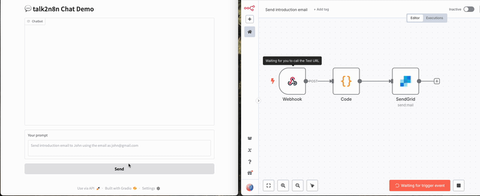

# talk2n8n

<p align="center">
  
</p>

Seamlessly execute any hosted n8n workflow (with a webhook trigger node) using everyday natural language. Instantly turn your words into workflow actions with Claude AI.

[](https://opensource.org/licenses/MIT)
[](https://www.python.org/downloads/)
[](https://github.com/psf/black)

---

**talk2n8n lets you trigger and interact with your hosted n8n workflows (webhook nodes only) using natural language—no technical knowledge required.**

- Effortlessly execute any n8n webhook workflow just by describing what you want in plain English
- Instantly connect your words to workflow actions powered by Claude AI
- Works with any n8n instance, securely and reliably

---

## Roadmap

- **Slack Integration:**
  - Slack bot support is a planned future feature. The codebase contains preliminary scaffolding for Slack event handling, but this feature is not yet available to end users. Stay tuned for updates!

---


- 🤖 Natural language to workflow execution (Claude/OpenAI)
- 🔄 LLM-powered workflow-to-tool conversion
- 🧩 Seamless n8n webhook integration
- 🧠 Intelligent parameter extraction and validation
- ⚡ Fast, robust, and extensible architecture
- 🔒 Secure API key and environment management
- 🖥️ Interactive CLI and modern Gradio chat UI

---

## Execution Flow

**How talk2n8n works (end-to-end):**

1. **Entry Points:**
   - Gradio Chat UI (`examples/chat.py`)
   - CLI Interactive Agent (`examples/simple.py`)
   - (Optional) Slack Integration (`src/talk2n8n/slack/handler.py`)

2. **User Input:**
   - User sends a natural language request (e.g., "Send introduction email to John using the email as john@gmail.com")

3. **Agent Core (`src/talk2n8n/agent/agent.py`):**
   - Receives the user message
   - Loads all available webhook workflows from the hosted n8n instance
   - Uses LangGraph state machine to decide if a tool (workflow) should be called
   - LLM (Claude/OpenAI) interprets the request and selects the appropriate tool/workflow

4. **ToolService (`src/talk2n8n/n8n/tool_service.py`):**
   - Converts n8n webhook workflows into callable tools using LLM analysis
   - Extracts required parameters from the user's message
   - Maintains a registry of available tools
   - Handles execution and error recovery

5. **n8n Client (`src/talk2n8n/n8n/client.py`):**
   - Constructs the correct webhook URL for the workflow
   - Sends an HTTP POST with extracted parameters to the hosted n8n webhook

6. **n8n Workflow Execution:**
   - The workflow runs on your n8n instance
   - Results (success/failure, output data) are returned to the Agent

7. **Agent Responds:**
   - The Agent returns the result to the user in the chat UI, CLI, or Slack

**Visual Overview:**

```
[User (Chat/CLI/Slack)]
        │
        ▼
   [Agent (LangGraph, LLM)]
        │
        ▼
 [ToolService (LLM Conversion, Registry, Exec)]
        │
        ▼
    [n8n Client]
        │
        ▼
 [Hosted n8n Webhook Workflow]
        │
        ▼
     [Result to User]
```

- All workflow discovery, conversion, and execution are automatic.
- Only workflows with webhook trigger nodes on a reachable hosted n8n instance are supported.
- Secure API key and environment management is enforced throughout.

---

## Project Structure

```
talk2n8n/
│
├── src/
│   └── talk2n8n/
│       ├── agent/         # Core Agent and state machine
│       ├── n8n/           # n8n API client, tool service, tool factory
│       ├── config/        # Settings, schemas, and workflow configs
│       ├── slack/         # Slack integration (optional)
│       └── utils/         # Utilities
│
├── examples/
│   ├── chat.py            # Gradio chat UI (modern, recommended)
│   └── simple.py          # CLI/interactive agent
│
├── tests/                 # Unit and integration tests
├── .github/               # CI/CD workflows
├── pyproject.toml         # Project metadata and dependencies (Poetry)
├── README.md
└── ...
```

---

## Quickstart

### 1. Clone and Install

```bash
git clone https://github.com/talk2silicon/talk2n8n.git
cd talk2n8n
python -m venv .venv
source .venv/bin/activate  # On Windows: .venv\Scripts\activate
pip install -e .
```
Or with Poetry:
```bash
poetry install
poetry shell
```

### 2. Configuration

Copy `.env.example` to `.env` and fill in your secrets:

```env
N8N_WEBHOOK_BASE_URL=https://your-n8n-instance.com
N8N_API_KEY=your-n8n-api-key
CLAUDE_API_KEY=your-claude-api-key
CLAUDE_MODEL=claude-3-haiku-20240307
N8N_ENV=development
LOG_LEVEL=INFO
```

> **Never commit your `.env` file to version control!**

---

## Usage

### Gradio Chat UI

```bash
PYTHONPATH=src python examples/chat.py
```
- Access the chat UI in your browser.
- Try: `Send introduction email to John using the email as john@gmail.com`

### Interactive CLI

```bash
PYTHONPATH=src python examples/simple.py
```
- Use the CLI to interact with the agent and trigger workflows.

---

## n8n Workflow Requirements

- Each workflow must have a webhook trigger node.
- Webhook paths should be clear (e.g., `/send-intro-email`).
- Parameters must be well-defined for LLM extraction.
- Name and describe workflows for best results.

---

## Development

- Code style: [black](https://github.com/psf/black), [flake8](https://flake8.pycqa.org/)
- Type checking: [mypy](http://mypy-lang.org/)
- Pre-commit hooks: `.pre-commit-config.yaml`
- Run tests: `pytest`

### Run all checks

```bash
./quality_check.sh
```

---

## CI/CD

- GitHub Actions for lint, test, type-check, and security.
- See `.github/workflows/` for details.

---

## Contributing

Contributions are welcome! Please see [CONTRIBUTING.md](CONTRIBUTING.md) and our [Code of Conduct](CODE_OF_CONDUCT.md).

---

## Security

For security issues, see [SECURITY.md](SECURITY.md).

---

## License

[MIT](LICENSE) 2025 talk2n8n Contributors

---

## Credits

Inspired by [talk2browser](https://github.com/talk2silicon/talk2browser).
